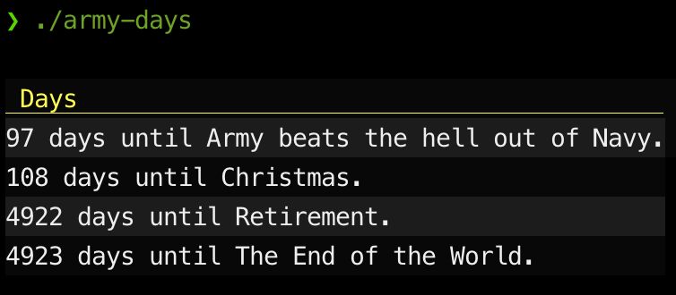

# Army Days



## Overview

A command-line program to display the number of days until certain events. This program (hence its name) is also based on the West Point requirement that first year cadets have to be able to recite "the days". Part of that tradition is that if it is past noon at the time, you subtract a day but add "and a butt". As most people aren't concerned about being West Point style, this is an optional feature that can be enabled via a flag. Past events can optionally be displayed via configuration.

## Development

### Compiling

```shell
go build
```

Should generate an `army-days` executable.

### Run Tests

```shell
go test ./...
```

or, with coverage:

```shell
go test ./... -cover
```

## Usage

The typical `--help` option will yield CLI information:

```shell
❯ ./army-days --help
usage: army-days [-h|--help] [-f|--file "<value>"] [-v|--version]

                 Calculate days until events

Arguments:

  -h  --help     Print help information
  -f  --file     Input file (JSON or YAML). Default: days.yaml
  -v  --version  version information
```

### Input file

The minimum required in input file would be an `entries` key and a list of 0 or more entry items. So, a rather useless but still *valid* configuration file could be:

```yaml
entries:
```

A more realistic minimal file might look like this:

```yaml
entries:
    - title: Christmas
      day: '2024-12-25'
```

If you want to turn on display of past events as well as turning on *Army* style "butt" days:

```yaml
config:
  useArmyButtDays: true
  showCompleted: true

entries:
  - title: Army beats the hell out of Navy
    date: '2024-12-14'
  - title: Christmas
    date: '2024-12-25'
```

You can also specify these same options in a .json file instead of .yaml.

### Output

Output is colorized and written to stdout. 


Obviously, this functionality is somewhat dependent on the support of your terminal. *Your actual results may very.*

However, if you pipe the output or redirect stdout, the program will automatically switch to JSON as the output format:

```shell
❯ ./army-days|jq
[
  {
    "title": "Army beats the hell out of Navy",
    "date": "2024-12-14T00:00:00Z",
    "days": 97
  },
  {
    "title": "Christmas",
    "date": "2024-12-25T00:00:00Z",
    "days": 108
  }
]
```

### Current Limitations

Issues that I'd like to address at some point:

* No option for disabling colorizing of output on stdout.
* There is currently no localization/customization of the header.
* Date handling is a little interesting since dates can be entered in the input file in RFC3339 format or date-only `2006-01-02` format. When entered as a simple date-only format, it's assumed to be midnight UTC, but when entered via a full RFC3339 datetime stamp format, it does have a timezone, but when the comparison to "now" is made, both dates are turned into a fresh midnight/UTC datetime. That means that if you are specifically wanting a more precise "number of days" to an event that you've specified in a timezone (say a specific event in Tokyo and you're in Atlanta), then the computed difference is going to be off by a day.
  * For the moment, this is by design to avoid some odd edge cases and since most users will use this for date-only features (essentially naive datetime focused around their local timezone).
  * A more correct design would be to use the local timezone as the default and also allow for overriding. Then convert the values to the local timezone. More research is needed to make sure unintended consequences aren't encountered.
* No option to import TOML data.
* No other output configuration options.
* No half ("butt") days are counted for past events. If it's after noon, we're not adding an extra half day to the past event.
  * NOTE: the output formatter *does* support half days as part of output, but the logic for calculating past events deliberately ignores half days for past events.
  * Handling of past events ought be more further configurable.
